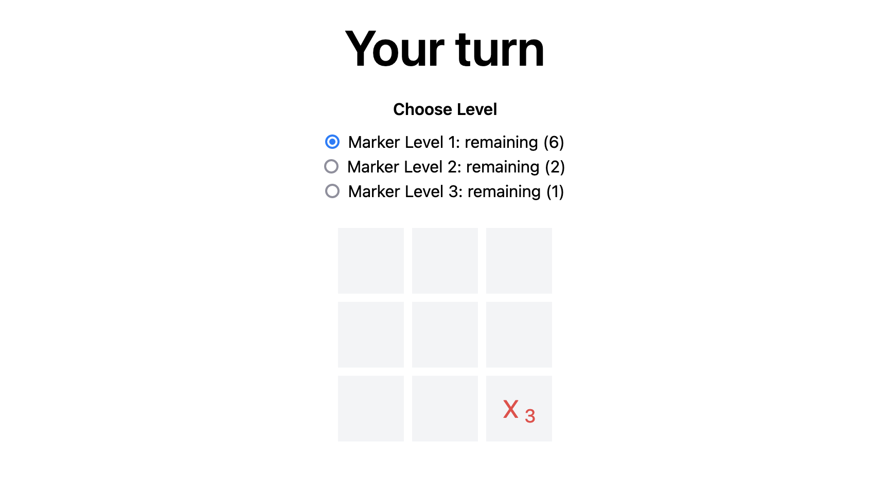
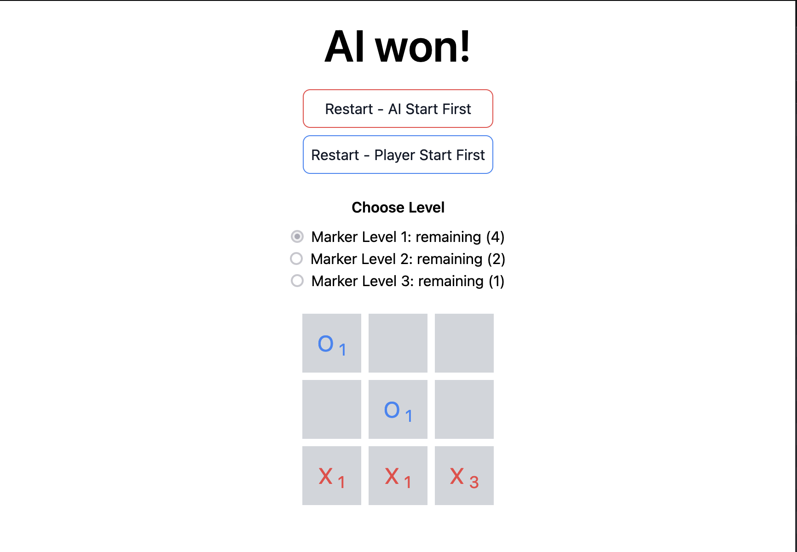

# Tic Tac Toe

This repository contains a simple implementation of the game Tic Tac Toe. It's included Web application and a REST API in full stack framework.

The Web application is built with [Next.js](https://nextjs.org/) and [Bun](https://bun.sh/) with AI-player trained with [Minimax Algorithm](https://en.wikipedia.org/wiki/Minimax).

# Screenshots





# Local Installation

1. Clone the repository

   ```
   git clone git@github.com:saenyakorn/tic-tac-toc.git
   ```

2. Install dependencies

   ```
   bun i
   ```

3. Prepare the environment variables, database, and code generation

   ```
   cp .env.sample .env
   # Prepare MySQL database
   docker compose up -d
   bun prisma db push
   # Prisma code generation
   bun prisma generate
   ```

   > You can change the environment variables in `.env` file.

4. Run the application as a dev server

   ```
   bun dev
   ```

   > The application will be running on http://localhost:3000

5. Train the model

   ```
   curl -X POST http://localhost:3000/api/game/ai/train
   ```

   > This step might take 4-6 hours to complete
